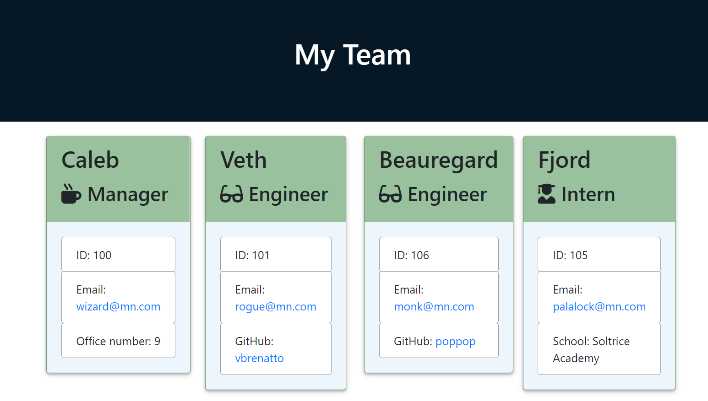

# Employee Summary

[](https://opensource.org/licenses/ISC)

## Table of Contents
* [Description](#Description)
* [Installation](#Installation)
* [Usage](#Usage)
* [License](#License)
* [Contributing](#Contributing)
* [Tests](#Tests)
* [Questions](#Questions)

## Description
A CLI interface for generating an HTML page with details about the members of an engineering team.



## Installation
To install app dependencies, run this command in your terminal:
```
npm i
```

## Usage
The HTML and CSS files are placed in an Output folder within the Develop directory. While the HTML file will function without the CSS, it won't be as well styled.

[](http://www.youtube.com/watch?v=cyi9sB0x2wI)

## License
This project uses the ISC license. For more details, visit [this link](https://opensource.org/licenses/ISC).

## Contributing
Create a fork and submit a pull request, or send me an email!

## Tests
To launch the tests, run this command in your terminal:
```
npm test
``` 

## Questions
If you have questions to ask or issues to report, please visit the [GitHub repository](https://github.com/ziieng/EmployeeSummary) for this project, [my GitHub profile](https://github.com/ziieng), or send me an email at cjengelhardt@gmail.com.
